# Project: Operationalizing a Coworking Space Microservice

## Coworking Space Service Extension

The Coworking Space Service comprises a suite of APIs that enable users to request one-time tokens and allow administrators to manage access to coworking spaces. Following a microservice architecture, each service is designed to be deployed and managed independently.

In this project, as the DevOps engineer, you will collaborate with a team responsible for developing an API that delivers key analytics on user activity within the service. Although the application runs smoothly in a local environment, your primary task is to create a pipeline for its deployment in a Kubernetes cluster.

## Getting Started

### Dependencies

#### Local Environment
1. **Python Environment**: Required to run Python 3.6+ applications and install Python dependencies using `pip`.
2. **Docker CLI**: Essential for building and running Docker images locally.
3. **kubectl**: Necessary to execute commands against a Kubernetes cluster.
4. **helm**: Needed to apply Helm Charts to a Kubernetes cluster.

#### Remote Resources

1. **AWS CodeBuild**: Used for remote Docker image builds.
2. **AWS ECR**: Hosts Docker images.
3. **Kubernetes Environment with AWS EKS**: Deploys applications in Kubernetes.
4. **AWS CloudWatch**: Monitors activity and logs in EKS.
5. **GitHub**: Pulls and clones the code repository.


#### Project Structure
```shell

├── CODEOWNERS
├── LICENSE.txt
├── README.md
├── analytics
│   ├── Dockerfile
│   ├── __init__.py
│   ├── app.py
│   ├── config.py
│   ├── model.py
│   └── requirements.txt
├── buildspec.yml
├── db
│   ├── 1_create_tables.sql
│   ├── 2_seed_users.sql
│   └── 3_seed_tokens.sql
├── deployment
│   ├── configmap.yaml
│   ├── coworking.yaml
│   └── secret.yaml
├── deployment-local
│   ├── configmap.yaml
│   └── coworking.yaml
├── Project_Screenshots
│   ├── kubectl_describe_svc_coworking.png
│   ├── kubectl_describe_svc_my-postgres-postgresql.png
│   ├── kubectl_get_deployments.png
│   ├── kubectl_get_pods.png
│   ├── kubectl_get_svc.png
│   ├── logging_cloudwatch_01.png
│   ├── logging_cloudwatch_02.png
│   ├── logging_cloudwatch_03.png
│   ├── logging_cloudwatch_04.png
│   ├── call_api_health_check.png
│   ├── call_api_readiness_check.png
│   ├── call_api_report_daily_usage.png
│   ├── call_api_report_user_visits.png
│   ├── codebuild_01.png
│   ├── codebuild_02.png
│   ├── codebuild_03.png
│   ├── ecr.png
│   ├── kubectl_describe_deployments_coworking.png
│   ├── kubectl_describe_pods_coworking.png
│   ├── kubectl_describe_pods_coworking-697c7985bf-bbff6.png
│   ├── kubectl_describe_pods_my-postgres-postgresql-0.png
│   ├── kubectl_describe_svc.png
└── scripts
    ├── create_cluster.sh
    ├── create_ecr.sh
    └── helm_sql.sh
```

- `scripts`: Bash scripts to facilitate project tasks.
- `db`: SQL scripts for seeding data.
- `deployment`: Kubernetes YAML files for deployment and configuration.

#### How to Run

1. Run `scripts/create_eks_cluster.sh coworking-cluster us-east-1`: Create a Kubernetes cluster and update `kubectl` configuration.
2. Run `scripts/create_ecr.sh coworking-repository us-east-1`: Create a repositoty.
3. Run `scripts/helm_sql.sh`: Create a PostgreSQL database service.
4. Run `scripts/deployment.sh`: Deploy using `kubectl`.
5. Export the Worker Role Name 
   1. Export the Worker Role Name 
   Run ` STACK_NAME = eksctl get nodegroup --cluster coworking-cluster -o json`
       `aws cloudformation describe-stack-resources --stack-name $STACK_NAME` 
       EX. $ROLENAME : eksctl-coworking-cluster-nodegroup-ng-0-NodeInstanceRole-13SDOLGQ0AB8D
   2. Add the necessary policy to the IAM role for your worker nodes
      Run `aws iam attach-role-policy --role-name $ROLENAME --policy-arn arn:aws:iam::aws:policy/CloudWatchAgentServerPolicy`
   3. Verify Role policies if attached.
      Run `aws iam list-attached-role-policies --role-name eksctl-coworking-cluster-nodegroup-NodeInstanceRole-prwvdX877GPQ`
   4. addon-name amazon-cloudwatch-observability
      Run `aws eks create-addon --addon-name amazon-cloudwatch-observability --cluster coworking-cluster`
6. add LoadBalancer
   Run `kubectl expose deployment coworking --type=LoadBalancer --name=coworking-ep`

### CloudWatch Metrics in EKS

Refer to [CloudWatch Metrics in EKS](https://docs.aws.amazon.com/AmazonCloudWatch/latest/monitoring/install-CloudWatch-Observability-EKS-addon.html) for more information on CloudWatch metrics in EKS.

### Get Web API URL

To access the Web API, follow these steps:

1. Get the load balancer external IP:
   ```shell
   kubectl describe
   ```
   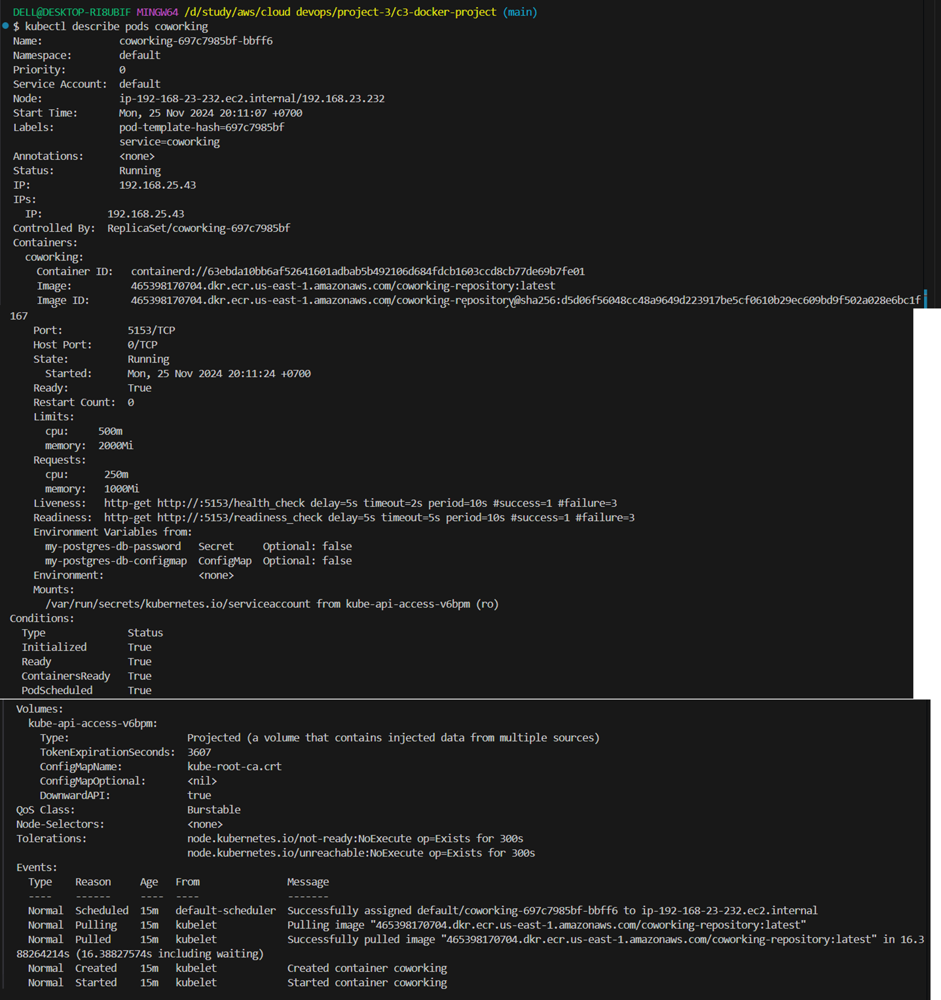
   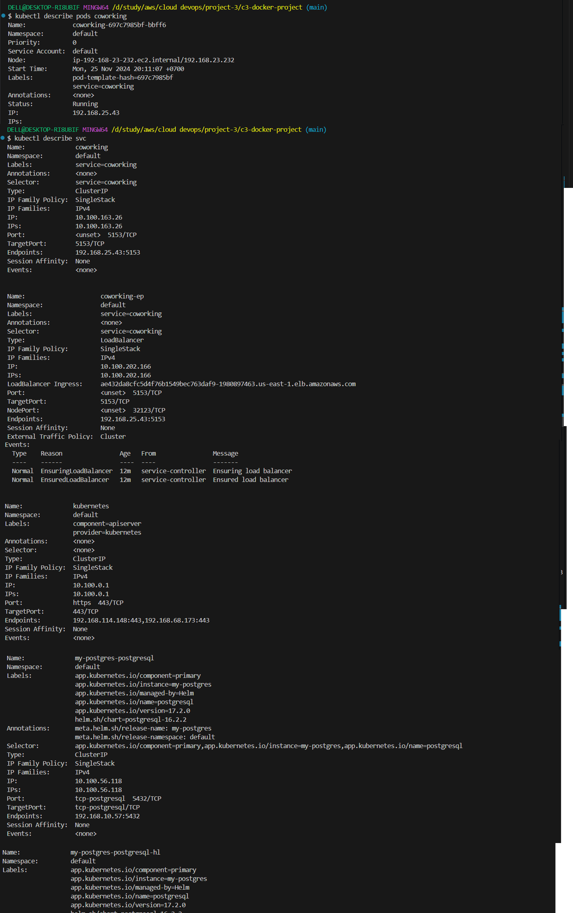
   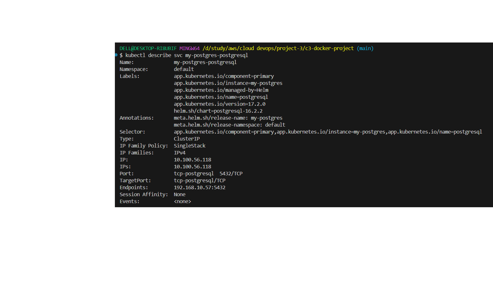
   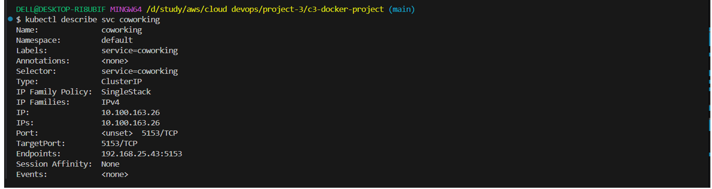
   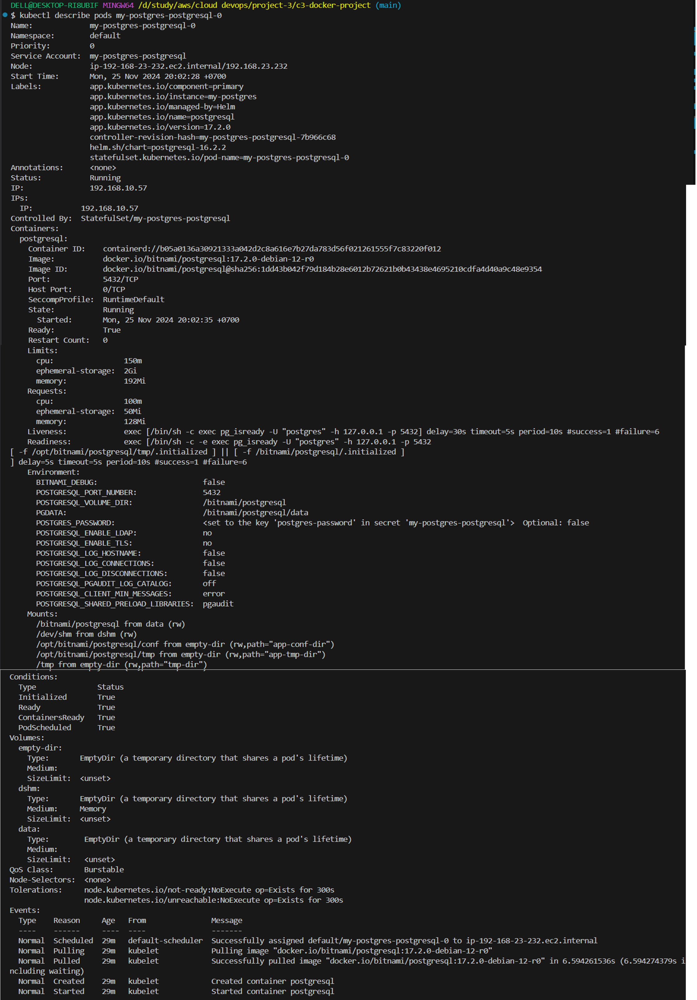
   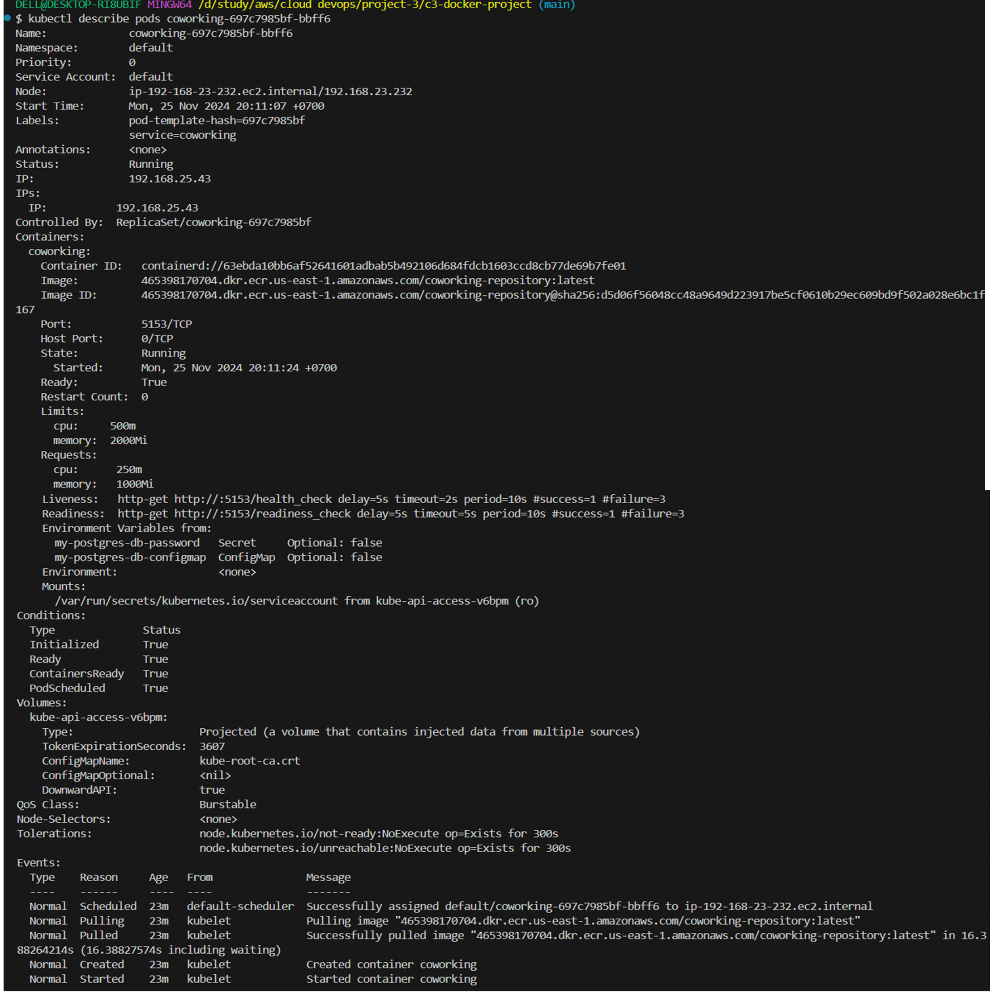
   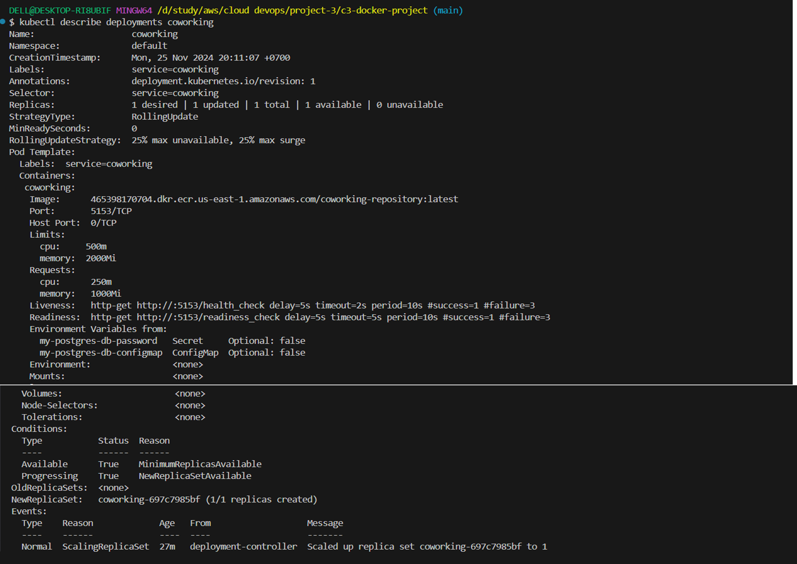

   ```shell
   kubectl get svc
   ```
   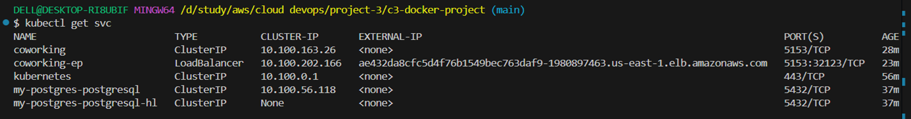

   ```shell
   kubectl get deployments
   ```
   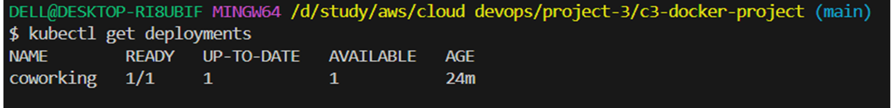

   ```shell
   kubectl get pods
   ```
   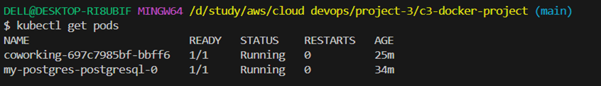

2. Access the Web API using the provided external IP.

   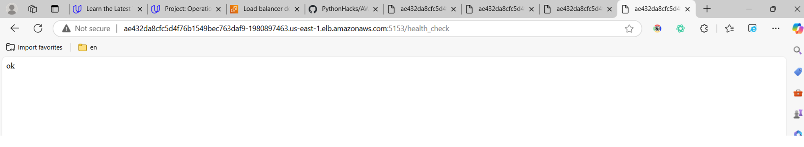
   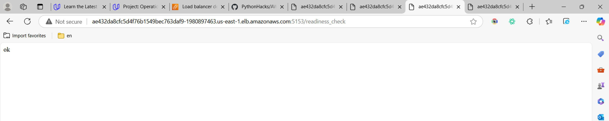
   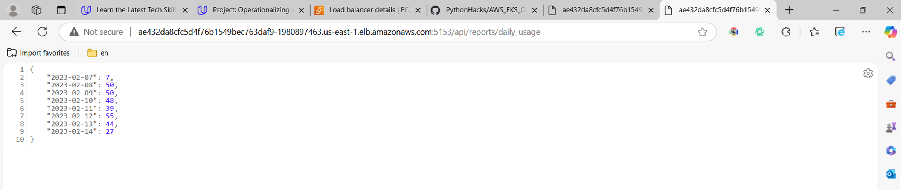
   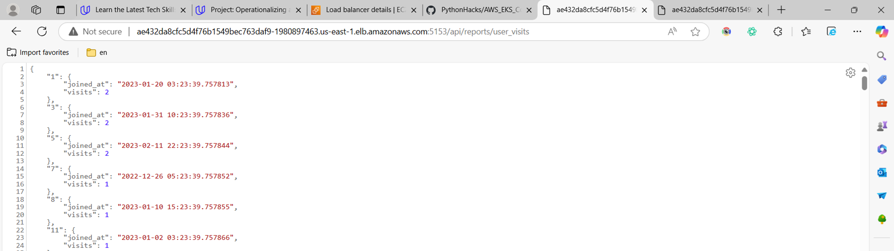

### CloudWatch

View metrics and logs in CloudWatch:

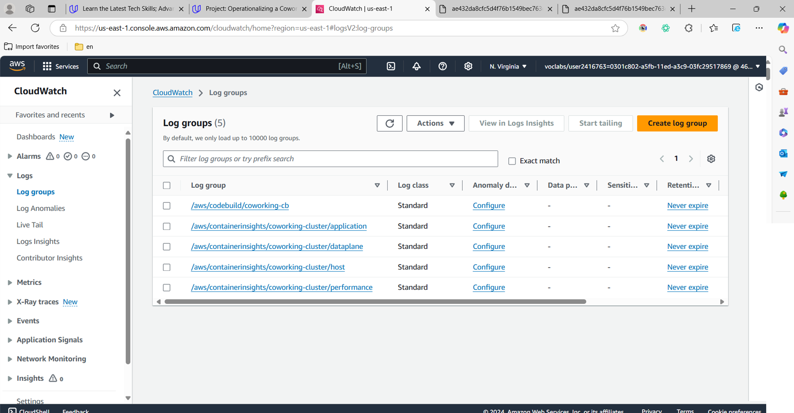
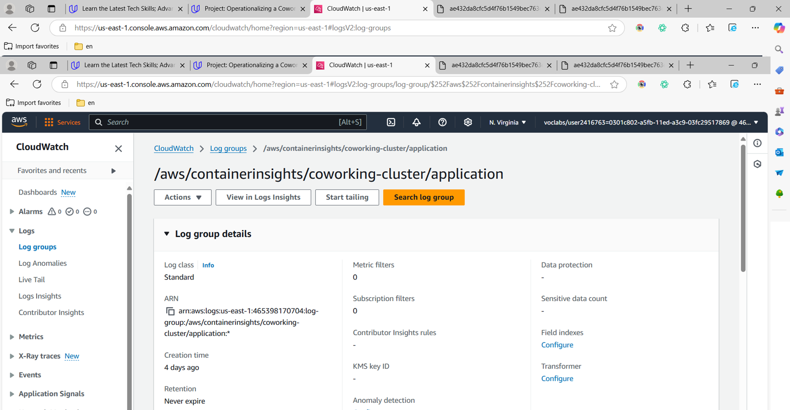
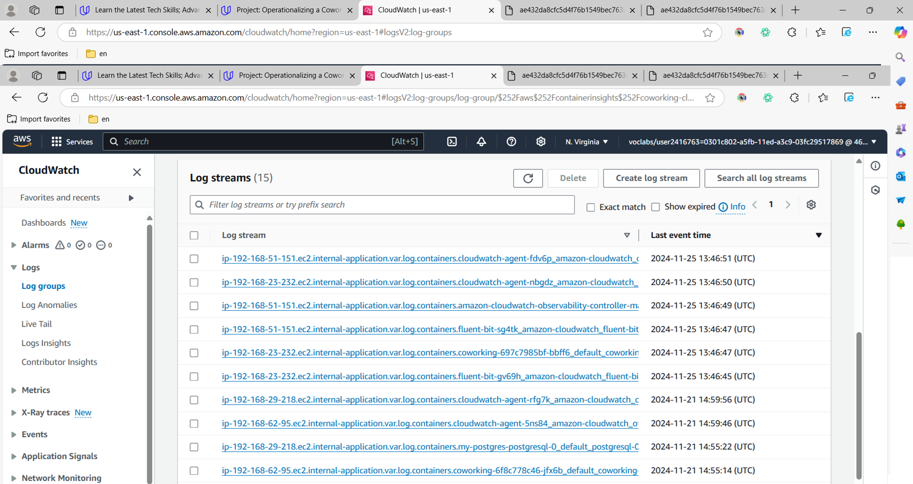
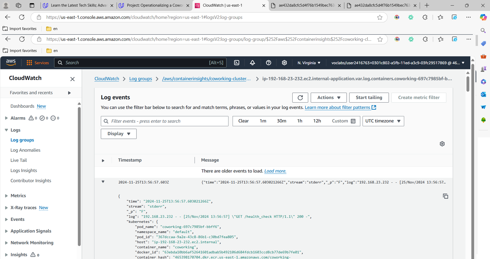